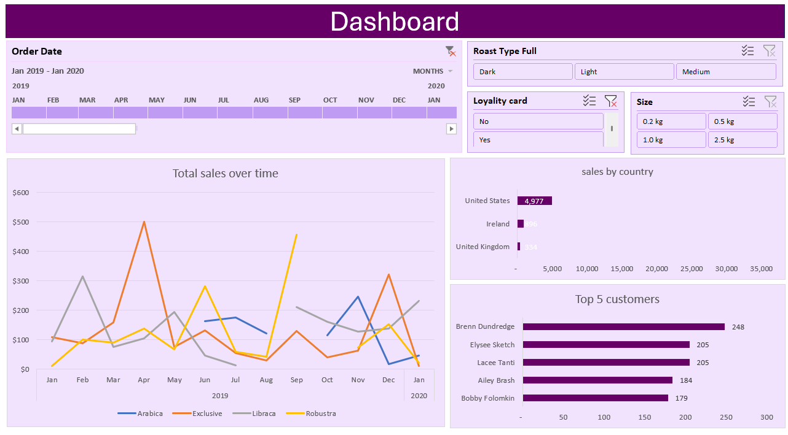

Coffee Sales Performance Dashboard (Excel)

An interactive Excel dashboard analyzing coffee sales trends across time, geography, product categories, and customer segments.

Project Overview

This dashboard was built to analyze business performance and answer key questions such as:

- How do total sales change over time?
- Which countries generate the highest revenue?
- Who are the top-performing customers?
- How do roast types and product sizes impact sales?
- Does loyalty membership influence purchasing behavior?

Dashboard Features

- 📅 Timeline filter (Order Date)
- ☕ Roast Type slicer (Dark, Light, Medium)
- 🎯 Loyalty Card filter
- 📦 Product Size filter
- 📈 Total Sales Over Time (Trend Analysis)
- 🌍 Sales by Country (Geographical comparison)
- 🏆 Top 5 Customers (Customer performance insight)

 Tools & Techniques Used

- Microsoft Excel
- Pivot Tables
- Pivot Charts
- Slicers
- Timeline Filter
- Dashboard Design & Layout Structuring
- Business KPI Analysis

Key Insights

- Sales show fluctuations across months, indicating seasonal demand patterns.
- The United States generates significantly higher sales compared to other countries.
- A small number of customers contribute disproportionately to total revenue.
- Product type and roast selection impact overall sales performance.
- Loyalty program participation influences purchasing trends.

Skills Demonstrated

- Business data analysis
- Interactive dashboard development
- Time-series trend analysis
- Customer segmentation
- Sales performance reporting
- Excel-based Business Intelligence

Dashboard Preview

